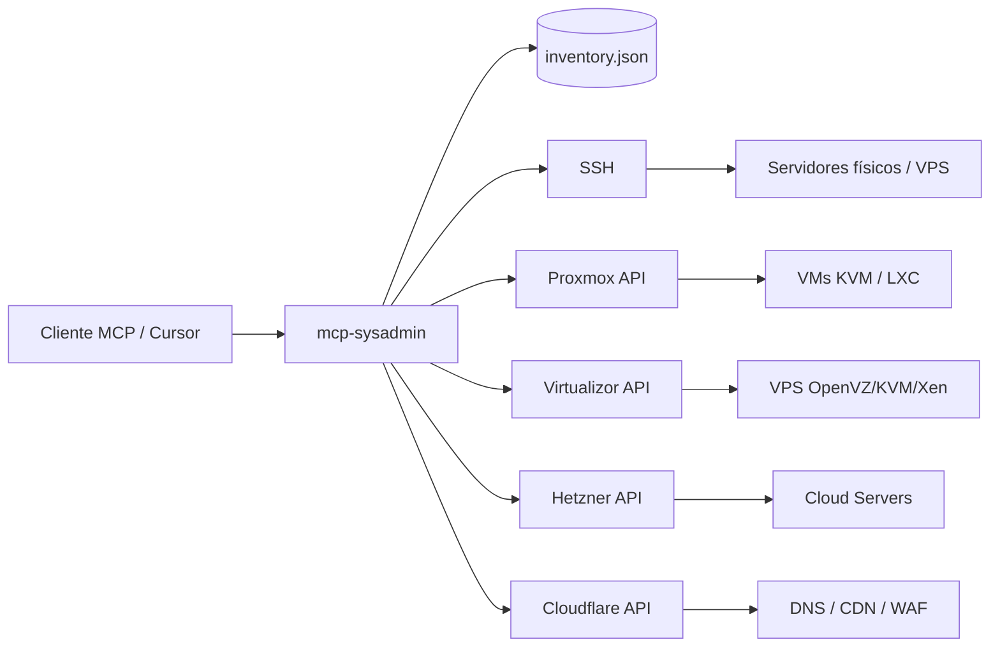

# MCP Sysadmin

Servidor MCP **agnóstico de proveedor** para administrar infraestructura heterogénea: servidores físicos, VPS por SSH, clusters **Proxmox VE**, paneles **Virtualizor**, **Hetzner Cloud** y **Cloudflare**.

A diferencia de MCPs atados a un hosting (p. ej. Cloudways), este proyecto usa un **inventario JSON** donde registras cada host con su proveedor y credenciales. Un mismo cliente MCP puede operar Proxmox en tu homelab, Virtualizor en un datacenter y servidores bare-metal en otra ubicación.

## Arquitectura



## Proveedores soportados

| Provider | Uso | Autenticación |
|----------|-----|---------------|
| `ssh` | Servidores físicos, VPS sin API, cualquier Linux | Clave privada o password |
| `proxmox` | Clusters / nodos Proxmox VE | API Token (`PVEAPIToken`) |
| `virtualizor` | Panel Virtualizor (Admin API) | `apiKey` + `apiPass` |
| `hetzner` | Hetzner Cloud (servidores, firewalls, volúmenes) | API Token (`Bearer`) |
| `cloudflare` | DNS, CDN, WAF (zonas y registros) | API Token (`Bearer`) |

## Tools incluidos (38)

### Inventario
- `list-hosts`, `get-host`

### Nodos / métricas
- `list-nodes`, `get-node-status`, `health-check`

### Máquinas virtuales / cloud
- `list-vms`, `list-containers`, `get-vm`, `vm-power`
- `list-vm-snapshots`, `create-vm-snapshot`
- `list-proxmox-tasks`, `get-proxmox-task`
- `list-storage-usage`, `list-backups`, `create-backup`
- `list-hetzner-firewalls`, `list-hetzner-volumes`

### Cloudflare (DNS / CDN)
- `list-zones`, `list-dns-records`, `get-dns-record`
- `create-dns-record`, `update-dns-record`, `delete-dns-record` (confirmToken)
- `purge-cache` (confirmToken)
- `list-waf-rules`

### Red
- `list-network`

### SSH — operaciones controladas
- `ssh-exec`, `ssh-read-file` (destructivas / confirmToken)

### SSH — diagnóstico read-only
- `ssh-tail-log` — journalctl o tail en `/var/log/`
- `list-firewall-rules` — UFW / nftables / iptables
- `list-systemd-units` — failed / running / all
- `cert-status` — certbot / fechas SSL
- `dns-lookup`, `check-endpoint`
- `list-cron`, `list-timers`
- `docker-compose-ps`

## Instalación

> 📖 **Manuales operativos:** consulta la carpeta [`manuales/`](./manuales/) para guías detalladas por provider y el [manual general de uso](./manuales/manual-general.md).

```bash
npm install
npm run build
```

## Configuración

1. Copia el inventario de ejemplo:

```bash
cp config/inventory.example.json config/inventory.json
```

2. Edita `config/inventory.json` con tus hosts reales.

3. Variables de entorno (opcional):

```bash
cp .env.example .env
```

```env
SYSADMIN_INVENTORY_PATH=./config/inventory.json
SYSADMIN_PRODUCTION_MODE=true
SYSADMIN_CONFIRM_TOKEN=un-secreto-largo-que-el-llm-no-conoce
SYSADMIN_READ_ONLY=false
SYSADMIN_REQUIRE_CONFIRM=true
SYSADMIN_RATE_LIMIT_MAX=30
SYSADMIN_HTTP_TIMEOUT_MS=30000
SYSADMIN_SSH_TIMEOUT_MS=30000
```

### ACL por host (inventario)

Cada host puede restringir qué tools puede usar el LLM:

```json
{
  "defaults": { "readOnly": false, "requireConfirm": true },
  "hosts": [
    {
      "id": "pve-prod",
      "readOnly": false,
      "allowedTools": ["list-vms", "get-vm", "vm-power"],
      "provider": "proxmox",
      "...": "..."
    }
  ]
}
```

- `readOnly: true` — solo tools de lectura en ese host
- `allowedTools` — lista blanca; si se omite, todas las tools del provider están permitidas

### Referencias a secretos en el inventario

Puedes usar `${VAR}` para no guardar credenciales en texto plano:

```json
{
  "tokenSecret": "${PROXMOX_HOMELAB_TOKEN}",
  "apiKey": "${VIRTUALIZOR_API_KEY}",
  "apiPass": "${VIRTUALIZOR_API_PASS}"
}
```

### Ejemplo: Proxmox

```json
{
  "id": "pve-prod",
  "name": "Proxmox Producción",
  "provider": "proxmox",
  "url": "https://10.0.0.2:8006",
  "tokenId": "root@pam!cursor-mcp",
  "tokenSecret": "${PROXMOX_TOKEN}",
  "verifySsl": false,
  "defaultNode": "pve1",
  "tags": ["production"]
}
```

Crea el token en Proxmox: **Datacenter → Permissions → API Tokens**.

### Ejemplo: Virtualizor

```json
{
  "id": "vz-panel",
  "name": "Virtualizor DC1",
  "provider": "virtualizor",
  "url": "https://panel.example.com:4085",
  "apiKey": "${VIRTUALIZOR_API_KEY}",
  "apiPass": "${VIRTUALIZOR_API_PASS}",
  "tags": ["vps"]
}
```

### Ejemplo: Servidor físico (SSH)

```json
{
  "id": "metal-01",
  "name": "Bare Metal Rack A",
  "provider": "ssh",
  "host": "203.0.113.50",
  "port": 22,
  "username": "root",
  "privateKeyPath": "~/.ssh/id_ed25519",
  "tags": ["physical", "production"]
}
```

### Ejemplo: Hetzner Cloud

```json
{
  "id": "hz-cloud",
  "name": "Hetzner Cloud",
  "provider": "hetzner",
  "apiToken": "${HETZNER_API_TOKEN}",
  "defaultLocation": "fsn1",
  "allowedTools": ["list-vms", "get-vm", "vm-power", "list-nodes", "health-check"],
  "tags": ["cloud", "hetzner"]
}
```

Crea el token en [Hetzner Cloud Console](https://console.hetzner.cloud/) → Security → API Tokens (permisos Read & Write para power actions).

### Ejemplo: Cloudflare

```json
{
  "id": "cf-main",
  "name": "Cloudflare Production",
  "provider": "cloudflare",
  "apiToken": "${CLOUDFLARE_API_TOKEN}",
  "defaultZoneId": "${CLOUDFLARE_ZONE_ID}",
  "readOnly": true,
  "allowedTools": ["list-zones", "list-dns-records", "get-dns-record", "list-waf-rules"],
  "tags": ["dns", "cdn"]
}
```

Crea un API Token en Cloudflare con permisos mínimos: Zone → DNS (Read) y, si necesitas escritura, DNS Edit + Cache Purge.

## Instalación por cliente MCP

Tras compilar el proyecto (`npm install && npm run build`), elige tu cliente. Todos usan transporte **stdio** (proceso local).

### Instalación rápida (1 clic)

> ⚠️ **Importante:** Los botones usan rutas plantilla `/path/to/mcp-sysadmin`. Cursor/VS Code mostrarán un diálogo de confirmación — **sustituye por la ruta absoluta de tu clone** y configura `SYSADMIN_CONFIRM_TOKEN` antes de instalar.  
> Para generar botones con **tus rutas reales** automáticamente:

```bash
./scripts/generate-install-links.sh
```

| Cliente | Botón |
|---------|-------|
| **Cursor** | [](https://cursor.com/en/install-mcp?name=mcp-sysadmin&config=eyJjb21tYW5kIjoiL3BhdGgvdG8vbWNwLXN5c2FkbWluL3NjcmlwdHMvcnVuLW1jcC5zaCIsImFyZ3MiOltdLCJlbnYiOnsiU1lTQURNSU5fSU5WRU5UT1JZX1BBVEgiOiIvcGF0aC90by9tY3Atc3lzYWRtaW4vY29uZmlnL2ludmVudG9yeS5qc29uIiwiU1lTQURNSU5fUFJPRFVDVElPTl9NT0RFIjoidHJ1ZSIsIlNZU0FETUlOX0NPTkZJUk1fVE9LRU4iOiJHRU5FUkFfQ09OX29wZW5zc2xfcmFuZF9oZXhfMzIiLCJTWVNBRE1JTl9SRVFVSVJFX0NPTkZJUk0iOiJ0cnVlIn19) |
| **VS Code** | [](https://vscode.dev/redirect/mcp/install?name=mcp-sysadmin&config=%7B%22name%22%3A%22mcp-sysadmin%22%2C%22command%22%3A%22%2Fpath%2Fto%2Fmcp-sysadmin%2Fscripts%2Frun-mcp.sh%22%2C%22args%22%3A%5B%5D%2C%22env%22%3A%7B%22SYSADMIN_INVENTORY_PATH%22%3A%22%2Fpath%2Fto%2Fmcp-sysadmin%2Fconfig%2Finventory.json%22%2C%22SYSADMIN_PRODUCTION_MODE%22%3A%22true%22%2C%22SYSADMIN_CONFIRM_TOKEN%22%3A%22GENERA_CON_openssl_rand_hex_32%22%2C%22SYSADMIN_REQUIRE_CONFIRM%22%3A%22true%22%7D%7D) |

El wrapper [`scripts/run-mcp.sh`](scripts/run-mcp.sh) resuelve rutas relativas al repo; los clientes MCP deben invocarlo con **ruta absoluta**.

---

### Cursor

**Archivo:** `~/.cursor/mcp.json` (global) o `.cursor/mcp.json` (por proyecto)

**UI:** *Settings → Tools & MCP → New MCP Server*

**1 clic:** botón **Add to Cursor** arriba, o deeplink:

```text
cursor://anysphere.cursor-deeplink/mcp/install?name=mcp-sysadmin&config=<base64>
```

**Manual:**

```json
{
  "mcpServers": {
    "sysadmin": {
      "command": "/ruta/absoluta/mcp-sysadmin/scripts/run-mcp.sh",
      "env": {
        "SYSADMIN_INVENTORY_PATH": "/ruta/absoluta/mcp-sysadmin/config/inventory.json",
        "SYSADMIN_PRODUCTION_MODE": "true",
        "SYSADMIN_CONFIRM_TOKEN": "tu-secreto-humano",
        "SYSADMIN_REQUIRE_CONFIRM": "true",
        "PROXMOX_HOMELAB_TOKEN": "..."
      }
    }
  }
}
```

---

### Claude Desktop

**Archivo:**

| SO | Ruta |
|----|------|
| macOS | `~/Library/Application Support/Claude/claude_desktop_config.json` |
| Windows | `%APPDATA%\Claude\claude_desktop_config.json` |

**UI:** *Settings → Developer → Edit Config*

Claude Desktop solo soporta **stdio**. Usa el mismo bloque `mcpServers` que Cursor (sin deeplink). **Reinicia la app** tras guardar.

```json
{
  "mcpServers": {
    "sysadmin": {
      "command": "/ruta/absoluta/mcp-sysadmin/scripts/run-mcp.sh",
      "env": {
        "SYSADMIN_INVENTORY_PATH": "/ruta/absoluta/mcp-sysadmin/config/inventory.json",
        "SYSADMIN_PRODUCTION_MODE": "true",
        "SYSADMIN_CONFIRM_TOKEN": "tu-secreto-humano"
      }
    }
  }
}
```

---

### Claude Code (CLI)

**Archivo:** `~/.claude.json` (global) o `.mcp.json` en el proyecto

**CLI:**

```bash
claude mcp add sysadmin -- /ruta/absoluta/mcp-sysadmin/scripts/run-mcp.sh
```

Define variables de entorno en el mismo archivo de config o exporta antes de lanzar `claude`.

---

### OpenCode

**Archivo:** `opencode.json` / `opencode.jsonc` (proyecto) o `~/.config/opencode/opencode.json` (global)

**CLI interactivo:**

```bash
opencode mcp add
# Tipo: local → command: ["/ruta/absoluta/mcp-sysadmin/scripts/run-mcp.sh"]
opencode mcp list
```

**Manual** (formato OpenCode — clave raíz `mcp`, no `mcpServers`):

```json
{
  "$schema": "https://opencode.ai/config.json",
  "mcp": {
    "sysadmin": {
      "type": "local",
      "command": ["/ruta/absoluta/mcp-sysadmin/scripts/run-mcp.sh"],
      "enabled": true,
      "environment": {
        "SYSADMIN_INVENTORY_PATH": "/ruta/absoluta/mcp-sysadmin/config/inventory.json",
        "SYSADMIN_PRODUCTION_MODE": "true",
        "SYSADMIN_CONFIRM_TOKEN": "tu-secreto-humano",
        "SYSADMIN_REQUIRE_CONFIRM": "true"
      }
    }
  }
}
```

> ⚠️ **Importante:** OpenCode usa `environment`, no `env`. El `command` debe ser un **array**.

---

### VS Code

**Archivo:** `.vscode/mcp.json` (workspace) o configuración de usuario MCP

**1 clic:** botón **Install MCP in VS Code** arriba.

**Manual:**

```json
{
  "servers": {
    "sysadmin": {
      "type": "stdio",
      "command": "/ruta/absoluta/mcp-sysadmin/scripts/run-mcp.sh",
      "env": {
        "SYSADMIN_INVENTORY_PATH": "/ruta/absoluta/mcp-sysadmin/config/inventory.json",
        "SYSADMIN_PRODUCTION_MODE": "true",
        "SYSADMIN_CONFIRM_TOKEN": "tu-secreto-humano"
      }
    }
  }
}
```

Requiere extensión **GitHub Copilot** con soporte MCP o extensión MCP compatible.

---

### Windsurf (Cascade)

**Archivo:** `~/.codeium/windsurf/mcp_config.json`  
(Windows: `%USERPROFILE%\.codeium\windsurf\mcp_config.json`)

**UI:** *Cascade → MCPs (icono) → Configure* o *Settings → Cascade → Manage MCPs → Add Server*

```json
{
  "mcpServers": {
    "sysadmin": {
      "command": "/ruta/absoluta/mcp-sysadmin/scripts/run-mcp.sh",
      "env": {
        "SYSADMIN_INVENTORY_PATH": "/ruta/absoluta/mcp-sysadmin/config/inventory.json",
        "SYSADMIN_PRODUCTION_MODE": "true",
        "SYSADMIN_CONFIRM_TOKEN": "tu-secreto-humano"
      }
    }
  }
}
```

Pulsa **Refresh** en la UI de MCPs tras guardar. Windsurf limita ~100 tools entre todos los servidores.

---

### Variables de entorno recomendadas (todos los clientes)

```env
SYSADMIN_INVENTORY_PATH=/ruta/absoluta/mcp-sysadmin/config/inventory.json
SYSADMIN_PRODUCTION_MODE=true
SYSADMIN_CONFIRM_TOKEN=<openssl rand -hex 32>
SYSADMIN_READ_ONLY=false
SYSADMIN_REQUIRE_CONFIRM=true
PROXMOX_HOMELAB_TOKEN=...
HETZNER_API_TOKEN=...
CLOUDFLARE_API_TOKEN=...
```

Desarrollo local del servidor (sin cliente MCP):

```bash
npm run dev
```

## Seguridad

### Modo producción

Activa siempre en prod:

```env
SYSADMIN_PRODUCTION_MODE=true
SYSADMIN_CONFIRM_TOKEN=<secreto-largo-aleatorio>
```

Con esto:
- SSH exige `hostKeyFingerprint` (anti-MITM) — **falla al arrancar** si falta
- **`SYSADMIN_CONFIRM_TOKEN` obligatorio** — falla al arrancar si falta
- SSH usa **allowlist** estricta (sin `cat`/`grep`; lecturas solo vía `ssh-read-file`)
- Prohibido `password` en inventario SSH
- `vm-power` requiere confirmación incluso para `start`
- Regex custom validadas (sin `.*` ni patrones demasiado amplios)

### Gate humano: `confirmToken`

El LLM puede poner `confirm: true` por prompt injection, pero **no conoce** `SYSADMIN_CONFIRM_TOKEN` (solo está en env del MCP, no en el chat):

```json
{
  "hostId": "bare-metal-01",
  "command": "systemctl status nginx",
  "confirm": true,
  "confirmToken": "tu-secreto-humano-no-compartir-con-el-modelo"
}
```

Tú proporcionas el token cuando apruebas la operación.

### Token de un solo uso (recomendado)

```bash
./scripts/mcp-approve.sh
# Válido 5 minutos; úsalo como confirmToken en la tool call
```

Alternativa: el token fijo `SYSADMIN_CONFIRM_TOKEN` en env MCP.

### Obtener fingerprint SSH

```bash
ssh-keyscan -H 10.0.0.5 | ssh-keygen -lf -
# Copia la línea SHA256:... al inventario como hostKeyFingerprint
```

### Controles implementados

| Control | Descripción |
|---------|-------------|
| **confirmToken** | Secreto humano en env MCP; el modelo no lo tiene por defecto |
| **Modo producción** | Allowlist SSH, host key pinning, sin passwords SSH |
| **Modo read-only** | `SYSADMIN_READ_ONLY=true` bloquea tools de escritura |
| **ACL por host** | `readOnly`, `allowedTools`, `allowedCommandPatterns` |
| **Allowlist SSH** | Solo diagnóstico (`systemctl status`, `journalctl`, `docker ps`, etc.) — **sin lectura de archivos** |
| **Lectura de archivos** | Exclusivamente vía `ssh-read-file` (paths + symlinks + confirmToken) |
| **cwd restringido** | Solo `/tmp`, `/var/log`, `/var/www`, `/home/*`, `/opt/*` en `ssh-exec` |
| **Regex inventario** | Patrones custom validados; prohibido `.*` y regex demasiado amplias |
| **Blocklist SSH** | Capa extra: `rm -rf`, pipes a shell, multiline, etc. |
| **Paths remotos** | `readlink -f` antes de leer; bloqueo de shadow/symlink bypass |
| **Rate limit** | 30 req/tool/host/min (configurable) |
| **TLS Proxmox** | `verifySsl` default `true` |
| **Redacción** | Secretos, configs VM, errores API filtrados |
| **Auditoría** | JSON en stderr: `[mcp-sysadmin:audit]` |

### Allowlist SSH por defecto

Incluye solo **diagnóstico operativo**: `systemctl status`, `journalctl`, `docker ps/logs`, `kubectl get`, `ls`, `df`, `free`, `nginx -t`, etc.

**No incluye** `cat`, `grep`, `head`, `tail` — usa `ssh-read-file` para leer archivos.

Añade patrones **específicos** en inventario (sin `.*`):

```json
{
  "allowedCommandPatterns": ["^systemctl restart nginx$"]
}
```

### Tools que requieren `confirm` + `confirmToken`

- `ssh-exec` — siempre
- `ssh-read-file` — siempre
- `vm-power` — todas las acciones en producción; stop/shutdown/reboot/reset siempre
- `create-vm-snapshot` — siempre
- `create-backup` — siempre
- `create-dns-record`, `update-dns-record`, `delete-dns-record`, `purge-cache` — siempre

### Checklist pre-producción

- [ ] `SYSADMIN_PRODUCTION_MODE=true`
- [ ] `SYSADMIN_CONFIRM_TOKEN` generado (`openssl rand -hex 32`)
- [ ] Fingerprint SSH en cada host
- [ ] Tokens Proxmox / Hetzner / Cloudflare con permisos mínimos
- [ ] `verifySsl: true` en Proxmox
- [ ] `allowedTools` por host según necesidad
- [ ] Inventario sin passwords en texto plano
- [ ] Probar una operación destructiva con token manual

## CI

GitHub Actions ejecuta `typecheck` + `build` en cada push/PR a `main`.

## Extensión

Para añadir otro proveedor (oVirt, VMware, AWS, etc.):

1. Añade el provider en `src/config/schema.ts`
2. Implementa cliente en `src/providers/<nombre>/client.ts`
3. Regístralo en `src/providers/registry.ts`
4. Expone tools en `src/tools/`

La estructura sigue el patrón del [cloudways-mcp-server](https://github.com/cgmorah/cloudways-mcp-server), pero con inventario multi-proveedor en lugar de una API única.

## Desarrollo

```bash
npm run typecheck
npm run build
```
