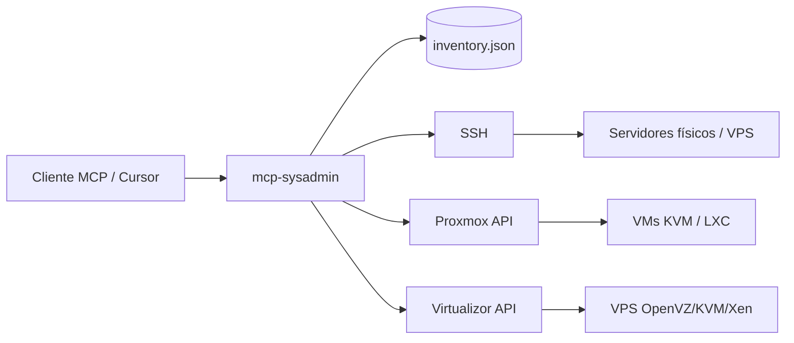

# MCP Sysadmin

Servidor MCP **agnóstico de proveedor** para administrar infraestructura heterogénea: servidores físicos, VPS por SSH, clusters **Proxmox VE** y paneles **Virtualizor**.

A diferencia de MCPs atados a un hosting (p. ej. Cloudways), este proyecto usa un **inventario JSON** donde registras cada host con su proveedor y credenciales. Un mismo cliente MCP puede operar Proxmox en tu homelab, Virtualizor en un datacenter y servidores bare-metal en otra ubicación.

## Arquitectura



## Proveedores soportados

| Provider | Uso | Autenticación |
|----------|-----|---------------|
| `ssh` | Servidores físicos, VPS sin API, cualquier Linux | Clave privada o password |
| `proxmox` | Clusters / nodos Proxmox VE | API Token (`PVEAPIToken`) |
| `virtualizor` | Panel Virtualizor (Admin API) | `apiKey` + `apiPass` |

## Tools incluidos

### Inventario
- `list-hosts` — Lista hosts del inventario (filtro por provider o tag)
- `get-host` — Detalle de un host (secretos redactados)

### Nodos / métricas
- `list-nodes` — Nodos Proxmox, servidores Virtualizor, o hosts SSH
- `get-node-status` — CPU, memoria, uptime (API o SSH)

### Máquinas virtuales
- `list-vms` — VMs en Proxmox + VPS en Virtualizor
- `get-vm` — Detalle de una VM/VPS
- `vm-power` — start / stop / shutdown / reboot / reset / suspend / resume
- `list-vm-snapshots` — Snapshots Proxmox
- `create-vm-snapshot` — Crear snapshot Proxmox
- `list-proxmox-tasks` — Tareas recientes en Proxmox

### SSH (servidores físicos y genéricos)
- `ssh-exec` — Ejecutar comando remoto
- `ssh-read-file` — Leer archivo remoto

## Instalación

```bash
npm install
npm run build
```

## Configuración

1. Copia el inventario de ejemplo:

```bash
cp config/inventory.example.json config/inventory.json
```

2. Edita `config/inventory.json` con tus hosts reales.

3. Variables de entorno (opcional):

```bash
cp .env.example .env
```

```env
SYSADMIN_INVENTORY_PATH=./config/inventory.json
SYSADMIN_READ_ONLY=false
SYSADMIN_REQUIRE_CONFIRM=true
SYSADMIN_HTTP_TIMEOUT_MS=30000
SYSADMIN_SSH_TIMEOUT_MS=30000
```

### ACL por host (inventario)

Cada host puede restringir qué tools puede usar el LLM:

```json
{
  "defaults": { "readOnly": false, "requireConfirm": true },
  "hosts": [
    {
      "id": "pve-prod",
      "readOnly": false,
      "allowedTools": ["list-vms", "get-vm", "vm-power"],
      "provider": "proxmox",
      "...": "..."
    }
  ]
}
```

- `readOnly: true` — solo tools de lectura en ese host
- `allowedTools` — lista blanca; si se omite, todas las tools del provider están permitidas

### Referencias a secretos en el inventario

Puedes usar `${VAR}` para no guardar credenciales en texto plano:

```json
{
  "tokenSecret": "${PROXMOX_HOMELAB_TOKEN}",
  "apiKey": "${VIRTUALIZOR_API_KEY}",
  "apiPass": "${VIRTUALIZOR_API_PASS}"
}
```

### Ejemplo: Proxmox

```json
{
  "id": "pve-prod",
  "name": "Proxmox Producción",
  "provider": "proxmox",
  "url": "https://10.0.0.2:8006",
  "tokenId": "root@pam!cursor-mcp",
  "tokenSecret": "${PROXMOX_TOKEN}",
  "verifySsl": false,
  "defaultNode": "pve1",
  "tags": ["production"]
}
```

Crea el token en Proxmox: **Datacenter → Permissions → API Tokens**.

### Ejemplo: Virtualizor

```json
{
  "id": "vz-panel",
  "name": "Virtualizor DC1",
  "provider": "virtualizor",
  "url": "https://panel.example.com:4085",
  "apiKey": "${VIRTUALIZOR_API_KEY}",
  "apiPass": "${VIRTUALIZOR_API_PASS}",
  "tags": ["vps"]
}
```

### Ejemplo: Servidor físico (SSH)

```json
{
  "id": "metal-01",
  "name": "Bare Metal Rack A",
  "provider": "ssh",
  "host": "203.0.113.50",
  "port": 22,
  "username": "root",
  "privateKeyPath": "~/.ssh/id_ed25519",
  "tags": ["physical", "production"]
}
```

## Uso con Cursor

Añade en la configuración MCP de Cursor:

```json
{
  "mcpServers": {
    "sysadmin": {
      "command": "node",
      "args": ["/ruta/absoluta/mcp-sysadmin/dist/index.js"],
      "env": {
        "SYSADMIN_INVENTORY_PATH": "/ruta/absoluta/mcp-sysadmin/config/inventory.json",
        "SYSADMIN_READ_ONLY": "false",
        "SYSADMIN_REQUIRE_CONFIRM": "true",
        "PROXMOX_HOMELAB_TOKEN": "tu-token",
        "VIRTUALIZOR_API_KEY": "tu-key",
        "VIRTUALIZOR_API_PASS": "tu-pass"
      }
    }
  }
}
```

Desarrollo local:

```bash
npm run dev
```

## Seguridad

### Controles implementados

| Control | Descripción |
|---------|-------------|
| **Modo read-only** | `SYSADMIN_READ_ONLY=true` bloquea `ssh-exec`, snapshots y acciones VM destructivas |
| **Confirmación** | Tools destructivas requieren `confirm: true` (desactivable con `SYSADMIN_REQUIRE_CONFIRM=false`) |
| **ACL por host** | `readOnly` y `allowedTools` en inventario limitan alcance por servidor |
| **Blocklist SSH** | Comandos peligrosos (`rm -rf`, `mkfs`, `curl\|bash`, etc.) rechazados automáticamente |
| **Paths sensibles** | `/etc/shadow` bloqueado siempre; claves SSH y `.env` requieren `confirm=true` |
| **TLS Proxmox** | `verifySsl` default `true`; usa `false` solo en lab |
| **Credenciales Virtualizor** | Enviadas por POST body, no en query string |
| **Redacción** | Secretos, configs VM y respuestas API filtradas antes de devolver al LLM |
| **Claves SSH** | Solo paths bajo `~/.ssh/`; sin path traversal |
| **Auditoría** | Cada invocación/bloqueo se registra en stderr como JSON (`[mcp-sysadmin:audit]`) |

### Tools que requieren `confirm: true`

- `ssh-exec` — siempre
- `ssh-read-file` — siempre (+ paths sensibles adicionales)
- `vm-power` — para `stop`, `shutdown`, `reboot`, `reset`
- `create-vm-snapshot` — siempre

### Buenas prácticas

- No commitees `config/inventory.json` ni `.env` con credenciales reales.
- Crea tokens Proxmox con permisos mínimos (no uses `root@pam` en producción si puedes evitarlo).
- Usa `${VAR}` en inventario para credenciales; pásalas via env de Cursor.
- Empieza con `SYSADMIN_READ_ONLY=true` hasta validar el inventario.
- Revisa los logs de auditoría en stderr del proceso MCP.

### Ejemplo: operación destructiva

```json
{
  "hostId": "bare-metal-01",
  "command": "systemctl restart nginx",
  "confirm": true
}
```

## Extensión

Para añadir otro proveedor (Hetzner, oVirt, VMware, etc.):

1. Añade el provider en `src/config/schema.ts`
2. Implementa cliente en `src/providers/<nombre>/client.ts`
3. Regístralo en `src/providers/registry.ts`
4. Expone tools en `src/tools/`

La estructura sigue el patrón del [cloudways-mcp-server](https://github.com/cgmorah/cloudways-mcp-server), pero con inventario multi-proveedor en lugar de una API única.

## Desarrollo

```bash
npm run typecheck
npm run build
```
