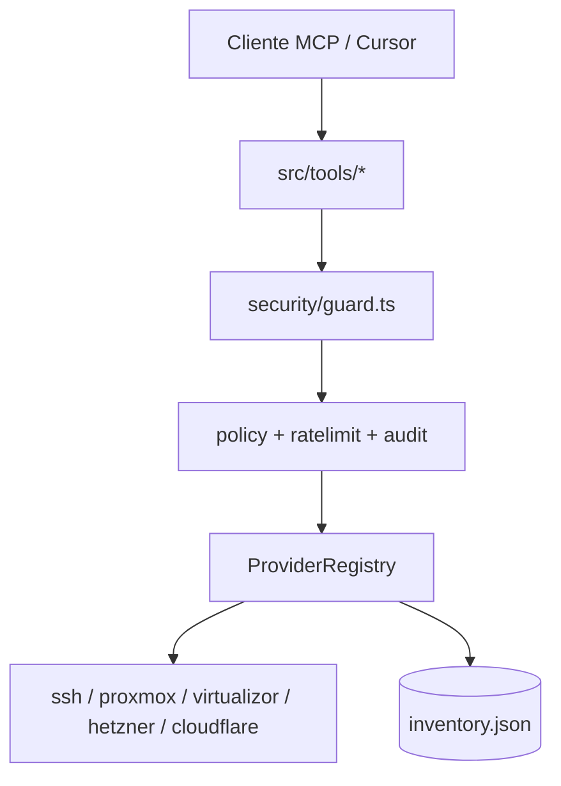

# Manual General — MCP Sysadmin

Documentación derivada del código en `src/index.ts`, `src/config/`, `src/security/`, `src/tools/` y `scripts/mcp-approve.sh`.

---

### 1. Resumen Ejecutivo y Propósito

**Objetivo:** MCP Sysadmin es un servidor [Model Context Protocol (MCP)](https://modelcontextprotocol.io/) que expone **38 tools** para administrar infraestructura heterogénea desde un cliente de IA (Cursor, Claude Desktop, etc.). A diferencia de MCPs atados a un único hosting, usa un **inventario JSON multi-proveedor**: cada host declara su `provider` (`ssh`, `proxmox`, `virtualizor`, `hetzner`, `cloudflare`) y credenciales propias. El impacto estratégico es unificar operaciones de diagnóstico, virtualización, cloud y DNS bajo un mismo punto de control, con políticas de seguridad aplicadas antes de que cualquier tool llegue a la API o al shell remoto.

**Prerrequisitos:**

| Requisito | Detalle |
|-----------|---------|
| **Runtime** | Node.js 18+ (recomendado LTS). |
| **Build** | `npm install && npm run build` en la raíz del repo. |
| **Inventario** | Archivo JSON válido según `InventorySchema` (Zod). Default: `config/inventory.json`. |
| **Cliente MCP** | Cursor u otro cliente con soporte MCP stdio. |
| **Producción** | `SYSADMIN_PRODUCTION_MODE=true` + `SYSADMIN_CONFIRM_TOKEN` en env del proceso MCP (no en el chat). |
| **Secretos** | Variables de entorno referenciadas con `${VAR}` en el inventario. |

> ⚠️ **Importante:** El LLM **no debe conocer** `SYSADMIN_CONFIRM_TOKEN`. Ese secreto vive solo en la configuración MCP del IDE. Sin él, las operaciones destructivas fallan aunque el modelo ponga `confirm: true`.

---

### 2. Guía Operativa Paso a Paso

#### Paso 1: Instalación y compilación

Clona o descarga el repositorio y compila el servidor TypeScript a JavaScript en `dist/`:

```bash
cd mcp-sysadmin
npm install
npm run build
```

Verifica que `dist/index.js` existe. Ese archivo es el punto de entrada del binario `mcp-sysadmin`.

#### Paso 2: Configurar el inventario

Copia el ejemplo y edítalo con tus hosts reales:

```bash
cp config/inventory.example.json config/inventory.json
```

El inventario tiene dos niveles de configuración:

- **`defaults`**: políticas globales (`readOnly`, `requireConfirm`, `sshAllowlistMode`, `allowedCommandPatterns`).
- **`hosts[]`**: cada entrada es un host con `id`, `name`, `provider` y campos específicos del proveedor.

Cada host puede restringir el alcance del LLM con:

- **`readOnly: true`** — solo tools de categoría `read`.
- **`allowedTools`** — lista blanca explícita de nombres de tool.

Consulta los manuales por provider en esta carpeta para los campos de credenciales de cada tipo.

#### Paso 3: Variables de entorno

Copia `.env.example` o define las variables en la config MCP de Cursor:

```env
SYSADMIN_INVENTORY_PATH=./config/inventory.json
SYSADMIN_PRODUCTION_MODE=true
SYSADMIN_CONFIRM_TOKEN=<openssl rand -hex 32>
SYSADMIN_READ_ONLY=false
SYSADMIN_REQUIRE_CONFIRM=true
SYSADMIN_RATE_LIMIT_MAX=30
SYSADMIN_HTTP_TIMEOUT_MS=30000
SYSADMIN_SSH_TIMEOUT_MS=30000
```

Las credenciales por host (`PROXMOX_HOMELAB_TOKEN`, `HETZNER_API_TOKEN`, etc.) se referencian en el inventario como `"${PROXMOX_HOMELAB_TOKEN}"` y se resuelven al arrancar el servidor.

#### Paso 4: Registrar el servidor en tu cliente MCP

Consulta la sección **[Instalación por cliente MCP](../README.md#instalación-por-cliente-mcp)** del README para:

- Botones **1 clic** (Cursor, VS Code)
- Configuración manual (Claude Desktop, OpenCode, Windsurf, Claude Code)
- Script `./scripts/generate-install-links.sh` con rutas absolutas de tu máquina

**Cursor (resumen):** añade en `~/.cursor/mcp.json` o `.cursor/mcp.json`:

```json
{
  "mcpServers": {
    "sysadmin": {
      "command": "/ruta/absoluta/mcp-sysadmin/scripts/run-mcp.sh",
      "env": {
        "SYSADMIN_INVENTORY_PATH": "/ruta/absoluta/mcp-sysadmin/config/inventory.json",
        "SYSADMIN_PRODUCTION_MODE": "true",
        "SYSADMIN_CONFIRM_TOKEN": "tu-secreto-no-compartir-con-el-modelo",
        "PROXMOX_HOMELAB_TOKEN": "...",
        "HETZNER_API_TOKEN": "...",
        "CLOUDFLARE_API_TOKEN": "..."
      }
    }
  }
}
```

Reinicia Cursor o recarga MCP servers. Las tools aparecerán con prefijo del servidor (`sysadmin`).

#### Paso 5: Flujo operativo con el agente

1. **Exploración (read-only):** pide al agente listar hosts, VMs, health checks o logs. No requieren token.
2. **Operación sensible:** cuando el agente proponga `ssh-exec`, `vm-power`, cambios DNS, etc., revisa la operación.
3. **Aprobación humana:** genera un token y pásalo al agente o inclúyelo tú en la tool call:

```bash
./scripts/mcp-approve.sh
# Token válido 5 minutos → úsalo como confirmToken
```

4. **Verificación:** el servidor valida ACL, rate limit, allowlist (SSH) y token antes de ejecutar.
5. **Auditoría:** cada invocación se registra en stderr como `[mcp-sysadmin:audit]`.

#### Paso 6: Desarrollo local

Para depurar sin Cursor:

```bash
npm run dev
# o
npm run typecheck && npm run build
```

---

### 3. Anatomía y Efectos en el Sistema (Deep-Dive)

| Dimensión | Impacto / Comportamiento |
|-----------|--------------------------|
| **Arranque** | `InventoryStore.load()` lee JSON → expande `${ENV}` → valida con Zod → `validateProductionConfig()` puede **abortar** el arranque si falta fingerprint SSH o confirm token en prod. |
| **Resolución de host** | Toda tool con `hostId` pasa por `ProviderRegistry.getHost()`; mismatch de provider lanza `SysadminError`. |
| **Guardia de tools** | `guardToolAccess()` aplica: ACL global/host → rate limit (30/min por tool+host) → audit log. |
| **Categorías** | `read` (22+ tools), `write` (`ssh-read-file`), `destructive` (power, snapshots, backups, DNS, ssh-exec). |
| **Confirmación** | `assertConfirmed()` exige `confirm=true` + token válido (estático o one-time de `mcp-approve.sh`). |
| **Agregación cross-provider** | `list-vms` y `list-nodes` sin `hostId` recorren todos los hosts del inventario que permitan la tool. |
| **Redacción** | Respuestas sanitizan secretos (`sanitizeHostRecord`, payloads Proxmox/Virtualizor). |
| **Side effect: SSH** | Comandos remotos reales; lectura de archivos con resolución `readlink -f`. |
| **Side effect: APIs** | Proxmox/Hetzner/Cloudflare/Virtualizor mutan estado remoto vía REST. |
| **Side effect: approve.json** | Token one-time se consume al validar (`src/security/approve.ts`). |

#### Arquitectura de capas



#### Tools transversales (todos los providers)

| Tool | Propósito | Confirmación |
|------|-----------|:------------:|
| `list-hosts` | Lista inventario (filtro `provider`, `tag`) | No |
| `get-host` | Detalle de host (secretos redactados) | No |
| `health-check` | Salud por provider (disco, nodos, token CF, etc.) | No |
| `list-network` | Red según provider (interfaces, IPs, DNS) | No |

#### Manuales por provider

| Provider | Manual |
|----------|--------|
| SSH | [provider-ssh.md](./provider-ssh.md) |
| Proxmox | [provider-proxmox.md](./provider-proxmox.md) |
| Virtualizor | [provider-virtualizor.md](./provider-virtualizor.md) |
| Hetzner Cloud | [provider-hetzner.md](./provider-hetzner.md) |
| Cloudflare | [provider-cloudflare.md](./provider-cloudflare.md) |

---

### 4. Preguntas Frecuentes y Solución de Problemas

#### El servidor MCP no arranca en producción

| Síntoma | Causa | Solución |
|---------|-------|----------|
| `Production mode requires SYSADMIN_CONFIRM_TOKEN` | Falta token en env MCP | Genera con `openssl rand -hex 32` y añádelo a config Cursor |
| `SSH host 'X' requires hostKeyFingerprint` | Host SSH sin fingerprint | `ssh-keyscan -H <ip> \| ssh-keygen -lf -` → copia SHA256 al inventario |
| `SSH password auth not allowed` | `password` en host SSH en prod | Usa `privateKeyPath` |
| `Missing environment variable referenced in inventory: VAR` | `${VAR}` sin definir en env | Añade la variable al bloque `env` de MCP |

#### Operación bloqueada en runtime

| Error | Causa | Solución |
|-------|-------|----------|
| `Confirmación requerida` | Falta `confirm: true` o `confirmToken` | Ejecuta `mcp-approve.sh` y pasa el token |
| `Tool 'X' blocked: host 'Y' is readOnly` | Host en solo lectura | Cambia `readOnly` o usa otro host |
| `Tool 'X' not in allowedTools` | Lista blanca restrictiva | Añade la tool a `allowedTools` del host |
| `Rate limit exceeded` | >30 llamadas/min por tool+host | Espera o ajusta `SYSADMIN_RATE_LIMIT_MAX` |
| `SYSADMIN_READ_ONLY=true` | Modo lectura global | Desactiva solo si es seguro |

#### El agente no ve las tools

- Verifica ruta absoluta a `dist/index.js`.
- Confirma que `npm run build` completó sin errores.
- Revisa logs MCP en Cursor (stderr del proceso).

#### ¿Puedo desactivar la confirmación?

Sí, con `SYSADMIN_REQUIRE_CONFIRM=false` o `defaults.requireConfirm: false` en inventario. **No recomendado en producción** — elimina el gate humano contra prompt injection.

#### Token one-time vs estático

| Método | Ventaja | Uso |
|--------|---------|-----|
| `mcp-approve.sh` | Expira en 5 min, se consume al usar | Operaciones puntuales |
| `SYSADMIN_CONFIRM_TOKEN` | Fijo en env | Automatización controlada |

> ⚠️ **Importante:** Nunca pegues el token en el chat con el LLM si no confías en el contexto. Pásalo fuera de banda o usa el script justo antes de la operación.

---

### 5. Ejemplos

#### Caso 1: Inventario mínimo multi-proveedor

Un equipo con homelab Proxmox, un VPS por SSH y DNS en Cloudflare:

```json
{
  "defaults": { "requireConfirm": true, "sshAllowlistMode": true },
  "hosts": [
    { "id": "pve", "provider": "proxmox", "url": "https://10.0.0.2:8006", "...": "..." },
    { "id": "web", "provider": "ssh", "host": "203.0.113.10", "readOnly": true, "...": "..." },
    { "id": "cf", "provider": "cloudflare", "apiToken": "${CLOUDFLARE_API_TOKEN}", "readOnly": true, "...": "..." }
  ]
}
```

**Para qué sirve:** el agente puede listar VMs en Proxmox, revisar logs del VPS (solo read) y consultar registros DNS, sin capacidad de mutar DNS ni ejecutar shell en el VPS.

#### Caso 2: Diagnóstico de incidencia sin riesgo

Prompt al agente:

> "Revisa el health-check de todo el inventario y dime qué hosts están degraded."

El agente invoca `health-check` sin parámetros. Recibes resumen `healthy/degraded/unreachable` por host. **No hay side effects.**

#### Caso 3: Reinicio controlado de servicio nginx

1. Host SSH con `allowedCommandPatterns: ["^systemctl restart nginx$"]`.
2. Agente propone `ssh-exec` con ese comando.
3. Tú ejecutas `./scripts/mcp-approve.sh` y das el token al agente.
4. Tool call:

```json
{
  "hostId": "bare-metal-01",
  "command": "systemctl restart nginx",
  "confirm": true,
  "confirmToken": "<token-del-script>"
}
```

**Efecto:** nginx se reinicia en el servidor remoto. Si el comando no coincide con allowlist + blocklist, falla antes de conectar.

#### Caso 4: ACL estricta para producción

Host Proxmox de producción solo con lectura y power explícito:

```json
{
  "id": "pve-prod",
  "provider": "proxmox",
  "allowedTools": ["list-vms", "get-vm", "vm-power", "health-check"],
  "readOnly": false
}
```

Snapshots y backups quedan **fuera** del alcance del LLM aunque el token Proxmox los permita en la API.

#### Caso 5: Modo auditoría total

```env
SYSADMIN_READ_ONLY=true
SYSADMIN_PRODUCTION_MODE=true
```

Todas las tools destructivas y de escritura fallan. Ideal para demos o entornos donde solo se permite exploración.

---

## Checklist pre-producción

- [ ] `SYSADMIN_PRODUCTION_MODE=true`
- [ ] `SYSADMIN_CONFIRM_TOKEN` generado y solo en env MCP
- [ ] Fingerprint SSH en cada host `provider: ssh`
- [ ] Tokens API con permisos mínimos por proveedor
- [ ] `allowedTools` definido por host según necesidad real
- [ ] Inventario sin passwords en texto plano
- [ ] Probada una operación destructiva con token manual
- [ ] Manuales por provider revisados en [README de manuales](./README.md)
